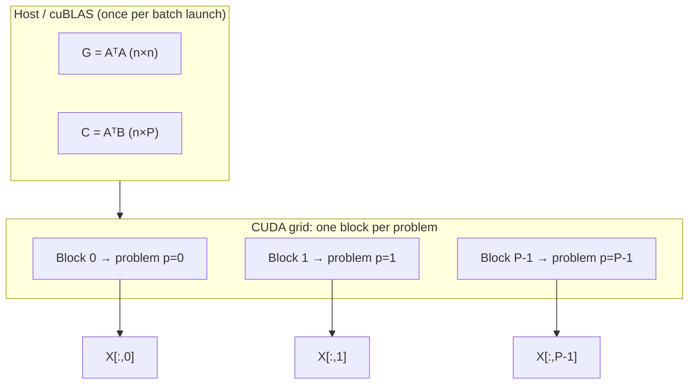

# NNLS Lawson Kernel: Detailed Walkthrough

This document explains `nnls_lawson_batched_kernel` in cuML and how it maps onto the MSA
(Mutational Signature Attribution) workload. The kernel implements the **Lawson–Hanson
active-set** method (same family as `scipy.optimize.nnls`), reformulated in **Gram space**
so each CUDA block can solve one masked NNLS problem without touching the tall design
matrix `A` again.

Source: `nnls_lawson.cuh`, launched via `nnls_batched_impl` in `nnls_batched.cuh`.

---

## 1. What Problem Is Being Solved?

For each problem `p` in a batch:


\min_{x \ge 0} \frac{1}{2}A x - b_p_2^2
\quad\text{subject to}\quad x_j = 0 \text{ if } \texttt{mask}(j,p)=0


Define the Gram form (constant terms dropped):


G = A^\top A \in \mathbb{R}^{n\times n}, \qquad c_p = A^\top b_p \in \mathbb{R}^n


f(x) = \frac{1}{2} x^\top G x - c^\top x, \qquad w(x) = c - Gx = -\nabla f(x)


At a KKT point for NNLS:

- **Active set** P = j : x_j > 0: w_j = 0 for j \in P
- **Inactive set** Z = j : x_j = 0: w_j \le 0 for j \in Z (no inactive column wants to enter)

The kernel tests optimality with: **stop when** \max_{j \in Z,\texttt{mask}(j)\neq 0} w_j \le \texttt{tol}.

---

## 2. Two-Level Parallelism




| Level      | Unit                           | Responsibility                                                 |
| ---------- | ------------------------------ | -------------------------------------------------------------- |
| **Grid**   | `blockIdx.x = p`               | One independent NNLS solve per block; `P` problems in parallel |
| **Block**  | `threadIdx.x ∈ [0, BlockSize)` | Cooperatively runs Lawson–Hanson for problem `p`               |
| **Warp**   | 32 threads                     | Warp-shuffle reductions (argmax, min)                          |
| **Thread** | 1 lane                         | Strided loops over `n`, `n²`, `np²` indices                    |


**Launch:** `<<<n_problems, BlockSize, smem_bytes, stream>>>`

**Block size:** occupancy-driven, starting at 1024 threads (32 warps), halving down to 32 if
needed (`LawsonBlockDispatch`).

**MSA mapping:** one kernel launch solves up to `gpu_batch_size` masked leave-one-out trials
(default 4096; GPU optimised path uses 65536 in `process_samples_batch`).

---

## 3. Data Movement (Global ↔ Shared ↔ Registers)

### 3.1 Before the Kernel (Host / Device Global Memory)

From `nnls_batched_impl`:

```cpp
// G = A^T A  (n x n),  C = A^T B  (n x P).  Formed once and reused by every
// problem in the batch.
raft::linalg::gemm(handle, At_view, A_view, G.view());
raft::linalg::gemm(handle, At_view, B_view, C.view());
```


| Buffer  | Shape              | Precision         | Shared by    | Notes                                                          |
| ------- | ------------------ | ----------------- | ------------ | -------------------------------------------------------------- |
| `A`     | `(m, n)` col-major | `float64` typical | all problems | MSA: `(n_channels, n_signatures)`                              |
| `B`     | `(m, P)`           | same              | —            | Target spectra; `b_index` selects column per problem in Python |
| `G`     | `(n, n)`           | `T`               | all blocks   | Read-only in kernel                                            |
| `C`     | `(n, P)`           | `T`               | —            | Block `p` reads column `p`                                     |
| `masks` | `(n, P)` uint8     | —                 | —            | Optional; masked columns never enter active set                |
| `X`     | `(n, P)`           | `T`               | —            | Output                                                         |


**Key design choice:** `A` is never read inside the kernel. All work uses `G` and `c = C[:,p]`.

### 3.2 Inside One Block (Dynamic Shared Memory)

Layout from `lawson_smem_layout`:


| Array                | Size           | Stored as                         | Role                                   |
| -------------------- | -------------- | --------------------------------- | -------------------------------------- |
| `G`                  | `n×n`          | `narrow_t<T>` (float if T=double) | Resident Gram matrix                   |
| `Gp`                 | `n×n`          | `narrow_t<T>`                     | Active-submatrix + Cholesky factor `L` |
| `c`                  | `n`            | `T`                               | RHS projection `Aᵀb`                   |
| `x`                  | `n`            | `T`                               | Current solution                       |
| `w`                  | `n`            | `T`                               | Gradient / dual residual `c − Gx`      |
| `s`                  | `n`            | `T`                               | Trial solve + Cholesky RHS             |
| `idx`                | `n`            | `int`                             | Compact active-set indices             |
| `act`                | `n`            | `int8`                            | 1 = active, 0 = inactive               |
| `red_val`, `red_idx` | `N_WARPS` each | scratch                           | Reductions + scalar broadcast          |


**Memory trick:** `G` and `Gp` are stored in float when `T=double`, roughly halving the
dominant `2n²` smem footprint; arithmetic still accumulates in `T`.

**Typical smem (double, narrowed G/Gp):** ~36 KB for `n=65`, ~51 KB for `n=78` — fits in
48–96 KB dynamic smem carveout.

### 3.3 Per-Block Data Flow Diagram

```
GLOBAL                          SHARED (one block)                    GLOBAL
──────                          ──────────────────                    ──────
G[n,n]  ──load+narrow──►  S.G[n,n]  (resident, read many times)
C[:,p]  ──load──────────►  S.c[n]
masks[:,p] ──view───────►  mask_col (read in argmax only)

Each outer iter:
  S.G, S.x ──matvec──► S.w[n]
  S.w, S.act, mask ──reduce──► j_star

Each inner iter:
  S.G, S.idx ──gather──► S.Gp[np,np]
  S.c, S.idx ──gather──► S.s[np] = c_P
  S.Gp ──Cholesky──► L
  S.s ──tri-solve──► s (unconstrained LS on P)
  S.x, S.s ──line search──► updated S.x, S.act, S.idx

S.x[n] ──store──────────► X[:,p]
```

---

## 4. Lawson–Hanson at Three Levels of Detail

### Level A — One Paragraph

Maintain active set `P`. Repeatedly: compute dual residual `w = c − Gx`; if some inactive
masked column has `w_j > tol`, add it to `P`; solve the unconstrained quadratic on `P`; if
the result is nonnegative, accept it; otherwise take the largest feasible step toward it,
zero out binding variables, and repeat. Stop when no column wants to enter or iteration budget
is exhausted.

### Level B — Pseudocode (Algorithmic)

```
INPUT: G, c, mask, tol, max_iter
INIT: x ← 0, act ← 0, idx ← [], n_active ← 0

FOR outer = 1 .. max_iter:
    w ← c − G·x                          // projected gradient

    (j*, w*) ← argmax{ w_j : act[j]=0 AND mask[j]≠0 }
    IF j* < 0 OR w* ≤ tol: BREAK         // optimal

    act[j*] ← 1; idx[n_active] ← j*; n_active++

    FOR inner = 1 .. (3n+1):              // inner budget
        np ← n_active
        G_P ← G[idx[0:np], idx[0:np]]     // gather to Gp
        c_P ← c[idx[0:np]]
        s ← solve(G_P · s = c_P)        // Cholesky + triangular solve
        IF Cholesky fails:
            undo j*; BREAK outer

        IF min(s) > 0:                   // feasible unconstrained step
            x ← 0; x[idx] ← s
            BREAK inner

        α ← min{ x_j / (x_j − s_j) : s_j ≤ 0, x_j − s_j > 0 }
        x[idx] ← x[idx] + α·(s − x[idx])

        // Drop variables that hit zero
        compact idx; act[j]=0 where x_j ≈ 0
        IF n_active = 0: BREAK inner

    IF numerical failure flag: BREAK outer

WRITE x to output
```

### Level C — What Each CUDA Phase Does (Block Steps)

#### Phase 1–2: Initialization (once per block)

```cpp
for (int q = tid; q < n * n; q += BlockSize)
  S.G[q] = static_cast<narrow_t<T>>(G.data_handle()[q]);
for (int j = tid; j < n; j += BlockSize) {
  S.c[j]   = C(j, p);
  S.x[j]   = T(0);
  S.act[j] = 0;
}
```


| Step                      | Parallelism                                         | Work                         |
| ------------------------- | --------------------------------------------------- | ---------------------------- |
| Load `G`                  | `tid` strides `q = tid, tid+BlockSize, …` over `n²` | Global → shared, narrow cast |
| Load `c`, zero `x`, `act` | `tid` strides over `n`                              | One column of `C`            |
| Init scalars              | `tid==0`                                            | `n_active=0`, flags          |


#### Phase 3: Outer Loop — Add a Column

**Step 3a — Gradient** (parallel matvec per row):


w_j = c_j - \sum_{k=0}^{n-1} G_{jk} x_k


Each thread `tid` owns rows `j = tid, tid+BlockSize, …` and loops `k` over all `n` (serial
inner loop per row — fine for small MSA `n`).

**Step 3b — Entering column** (`block_argmax_inactive`):


j^ = \arg\max_{\substack{j: \texttt{act}[j]=0  \texttt{mask}(j)\neq 0}} w_j


Parallel pattern: per-thread local max → warp shuffle → cross-warp reduction in warp 0 →
broadcast via `red_val[0]`, `red_idx[0]`.

**Convergence (outer):** if `j* < 0` or `max_w ≤ tol`, break.

**Step 3c — Activate:** thread 0 sets `act[j*]=1`, appends `j`* to `idx`, increments `n_active`.

#### Phase 4: Inner Loop — Solve on Current Active Set

**Step 4a — Gather submatrix and RHS:**


G_P[i,j] = G_{\texttt{idx}[i],\texttt{idx}[j]}, \qquad s_i = c_{\texttt{idx}[i]}


Parallel over `np²` (gather) and `np` (RHS).

**Step 4b — Cholesky** (`block_cholesky`):

Factor G_P = LL^\top in-place in `Gp`, with Tikhonov regularization:


G_P(k,k) \leftarrow G_P(k,k) + \varepsilon, \quad \varepsilon = 10^{-7}\cdot\frac{\mathrm{tr}(G_P)}{n_p} (\text{float storage})


Parallelism per pivot `k`:

- Thread 0: `sqrt` diagonal, broadcast via `red_val[0]`
- All threads: scale column below diagonal
- All threads: strided outer-product update on trailing block

**Step 4c — Triangular solve** (`block_chol_solve`):

Solve G_P s = c_P via forward Ly=c_P and back L^\top s=y.

Sequential in row index `i`, but each update row parallelizes over trailing/prior indices —
standard small-n cooperative pattern.

**Step 4d — Feasibility test:**


s_{\min} = \min_{j=0}^{n_p-1} s_j


If s_{\min} > 0: trial solution is feasible — zero `x`, scatter `x[idx[j]] = s[j]`, exit
inner loop (outer iteration complete).

**Step 4e — Line search (partial step):**

For binding indices (s_j \le 0):


\alpha = \min_{\substack{j: s_j \le 0  x_j - s_j > 0}} \frac{x_j}{x_j - s_j}


Then:


x_j \leftarrow x_j + \alpha(s_j - x_j) \quad \forall j \in P


**Step 4f — Drop zeros from active set:**

Thread 0 compacts `idx`, clearing `act[j]` and `x[j]` where x_j \le \varepsilon
(`1e-15` double / `1e-12` float).

**Inner exit conditions:** feasible solution found; `n_active==0`; inner budget `3n+1`
exhausted; Cholesky failure (undo last add, break outer).

#### Phase 5: Writeback

```cpp
for (int j = tid; j < n; j += BlockSize)
  X(j, p) = S.x[j];
```

---

## 5. Convergence: When Does a Block Stop?


| Criterion            | Condition                                         | Meaning                                        |
| -------------------- | ------------------------------------------------- | ---------------------------------------------- |
| **Optimality**       | \max_{j \in Z,\text{masked}} w_j \le \texttt{tol} | No inactive column wants weight; KKT satisfied |
| **Outer cap**        | `outer == max_iter`                               | Default `max_iter = 3n+1` if unset             |
| **Inner cap**        | `inner == 3n+1` per outer step                    | Prevents infinite inner cycling                |
| **Cholesky failure** | non-positive pivot after regularization           | Undo last activation; stop outer               |
| **Empty active set** | `n_active == 0` after binding                     | Degenerate; exit inner                         |


Default `tol = 1e-6` (`NnlsBatchedParams`). MSA does not override this in
`_gpu_batched_solve_and_score`.

**MSA-level convergence** (outside the kernel): greedy signature removal stops per-sample when
no leave-one-out trial drops similarity by more than `weak_threshold` (default 0.01), or only
one signature remains.

---

## 6. Parallelization Patterns Inside One Block


| Operation                | Threads do                                                    | Synchronization          |
| ------------------------ | ------------------------------------------------------------- | ------------------------ |
| Load `G`, init `c,x,act` | Strided `for (i=tid; i<N; i+=BlockSize)`                      | `__syncthreads`          |
| Gradient `w = c - Gx`    | One row per strided thread; inner `k` loop serial             | `__syncthreads`          |
| Argmax / min / min-α     | Local scan → warp `shfl_xor` → warp-0 cross-warp              | `__syncthreads`          |
| Gather `G_P`             | Strided over `np²`                                            | `__syncthreads`          |
| Cholesky                 | Per-`k` pivot: t0 diag; parallel column scale + rank-1 update | `__syncthreads` each `k` |
| Tri-solve                | Per row: t0 divide; parallel axpy                             | `__syncthreads` each row |
| Line search update       | Strided over `np`                                             | `__syncthreads`          |
| Compact active set       | Thread 0 only                                                 | `__syncthreads`          |


**Occupancy trade-off:** larger `BlockSize` (1024) helps parallelize `n²` Cholesky updates;
smaller blocks allow more concurrent problems when smem-bound or batch is huge
(`LawsonBlockDispatch` targets `8 × resident_blocks ≥ n_problems`).

---

## 7. MSA Dimension Variables (from Project Data)

Symbols follow cuML (`m`, `n`, `P`) and MSA (`n_channels`, `n_signatures`, etc.).


| Symbol              | Code name                    | Meaning                                   | Typical MSA values                                                                                                             |
| ------------------- | ---------------------------- | ----------------------------------------- | ------------------------------------------------------------------------------------------------------------------------------ |
| `m`                 | `n_channels`, `A.shape[0]`   | Mutation channels (rows of `A`)           | **96** (SBS-96), 192, 288, 1536, 4608; **78** (DBS), **83** (ID)                                                               |
| `n`                 | `n_signatures`, `A.shape[1]` | Reference signatures (cols of `A`)        | **65** (SBS-96 catalog), **54** (SBS-192), **10** (SBS-288/1536/4608), **11** (DBS), **17** (ID)                               |
| `P`                 | `n_problems`                 | Problems per kernel launch                | **4096** default `--gpu_batch_size`; up to **65536** in GPU optimised path; ≤ `#active_samples × #active_sigs` per greedy step |
| `np`                | `sm_n_active`                | Active-set size during solve              | Starts at `n` (all masked-in sigs); shrinks to **~1–15** after optimisation                                                    |
| `n_samples`         | `B.shape[1]`                 | Tumour samples in one run                 | **1000** (`SIM_ESCC` SBS-96 input)                                                                                             |
| `max_iter`          | kernel param                 | Outer Lawson iterations                   | `**3n+1`** default → **196** for `n=65`, **34** for `n=11`                                                                     |
| `tol`               | kernel param                 | Dual residual threshold                   | **1e-6** (cuML default)                                                                                                        |
| `inner_budget`      | `3*n+1`                      | Inner loop cap per outer step             | Same as default `max_iter`                                                                                                     |
| `BlockSize`         | template param               | Threads per block                         | **1024** down to **32** (occupancy dispatch)                                                                                   |
| `smem`              | `lawson_smem_bytes(n)`       | Dynamic shared memory / block             | **~36 KB** (`n=65`), **~51 KB** (`n=78`), **~1.5 KB** (`n=10`)                                                                 |
| `chunk_size`        | `--gpu_batch_size`           | Max NNLS problems per `nnls_batched` call | **4096** (CLI default), **65536** (GPU batch in code)                                                                          |
| `samples_per_group` | `chunk_size // n_sig`        | Samples grouped per greedy step           | **~63** for SBS-96 (`4096//65`), **~372** (`65536//65`)                                                                        |
| `n_trials` / step   | `Σ active_sigs per sample`   | Leave-one-out problems per greedy step    | Roughly `**#active_samples × avg_active_sigs`** (≤ chunk)                                                                      |


### Example: `run_NNLS.py -d SIM_ESCC -t SBS -c 96 -x --use_gpu --nnls-backend cuml --nnls-solver lawson`


| Quantity         | Value                                                                       |
| ---------------- | --------------------------------------------------------------------------- |
| `A` (signatures) | `(96, 65)`                                                                  |
| `B` (mutations)  | `(96, 1000)` samples                                                        |
| `G` precompute   | `(65, 65)` — once per batch launch                                          |
| `C` precompute   | `(65, P)` — `P` = problems in chunk                                         |
| Per kernel block | One masked leave-one-out fit for one sample                                 |
| Dominant cost    | Many thousands of small `n=65` active-set solves, not one big least-squares |


### Mutation-Type Quick Reference


| Mutation | Context      | `(m, n)` channels × signatures |
| -------- | ------------ | ------------------------------ |
| SBS      | 96 (default) | (96, 65)                       |
| SBS      | 192          | (192, 54)                      |
| SBS      | 288          | (288, 10)                      |
| SBS      | 1536         | (1536, 10)                     |
| SBS      | 4608         | (4608, 10)                     |
| DBS      | —            | (78, 11)                       |
| ID       | —            | (83, 17)                       |


For large contexts (1536, 4608), Lawson is less attractive: `m` is huge but the kernel only
uses `n` (small); the **cuBLAS `G = AᵀA` setup** dominates, and other solvers (APG/CD) may be
preferable. For the default MSA hot path (SBS-96, `n≈65`), Lawson in Gram form is a good fit.

---

## 8. End-to-End MSA + Kernel Flow

```
run_NNLS.py: optimise_signatures_batched()
  └─ each greedy step: batched_solve_and_score()
       └─ chunks of masks[:, start:stop]  (P problems)
            └─ cuml nnls_batched(solver="lawson")
                 ├─ cuBLAS: G = AᵀA, C = AᵀB     [global, once]
                 └─ nnls_lawson_batched_kernel
                      ├─ block p: load G, c=C[:,p], solve masked NNLS
                      └─ write X[:,p]
                 └─ (optional) fitted = A @ X for similarity score
```

Each block is **fully independent** after `G` and `C` are built; the batch scales with GPU SM
count × occupancy. Convergence is **per-block exact active-set** (up to `tol` and numerical
safeguards), while MSA **outer greedy logic** decides which signature masks to try next.