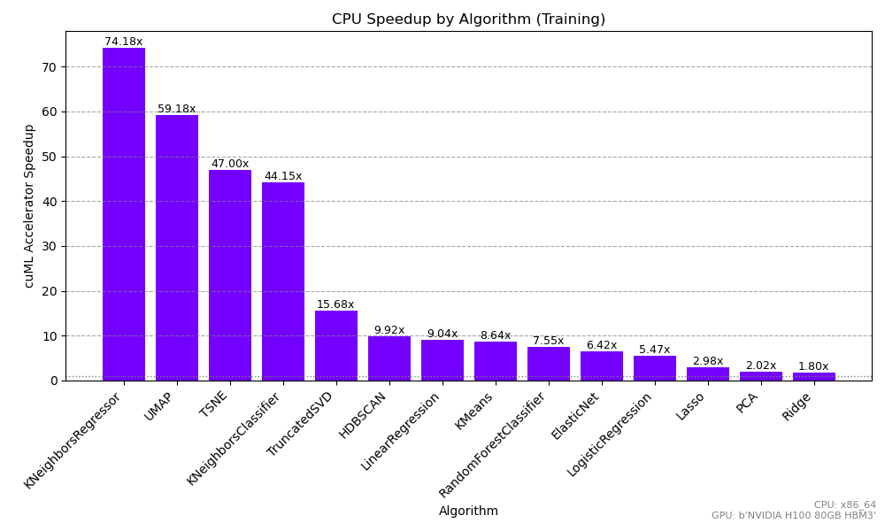
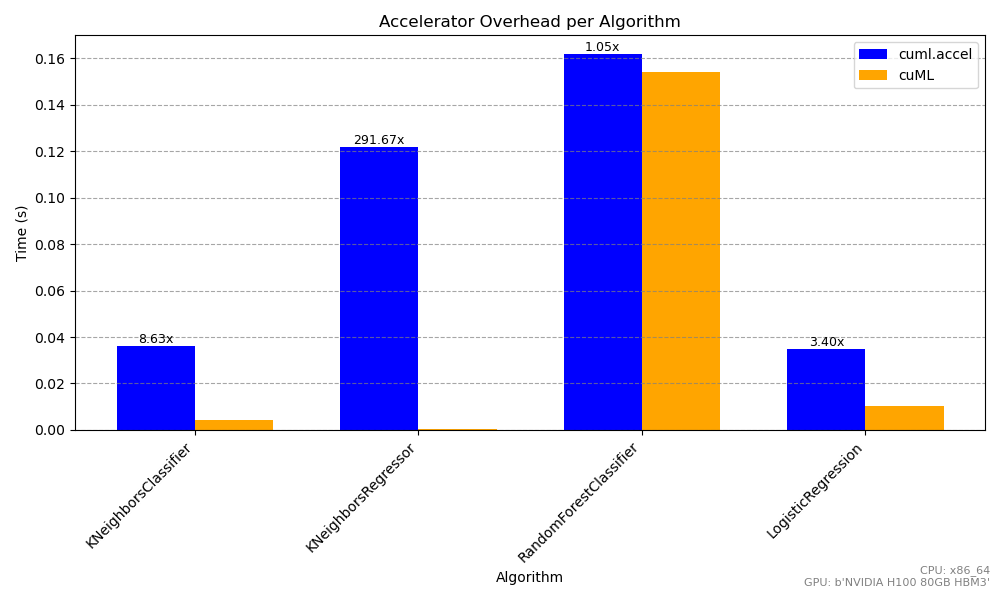

Benchmarks
==========

cuML offers accelerated inference and training for classical ML models using NVIDIA GPUs. With cuml.accel, you can get the benefit of similar acceleration in existing Scikit-Learn, UMAP, and HDBScan scripts without changing a line of code. While the exact speedup depends on the model, dataset size, and hyperparameters, the following benchmarks should give a general sense of the benefit you're likely to observe when using `cuml.accel.`

Training
--------

While both training and inference benefit from GPU acceleration, cuML tends to offer even more significant gains for training than inference. Training times 2-80 times faster are typical for cuML, especially with large datasets. `cuml.accel` offers similar speedups without requiring any cuML-specific code changes.

Relatively complex manifold algorithms like HDBSCAN, t-SNE, and UMAP tend to see the largest benefit from `cuml.accel`. Speedups of 60x to 300x are typical for realistic workloads. Simpler algorithms like KMeans and Random Forest can also see speedups of 15x to 80x. Even the simplest ML algorithms, like Logistic Regression, Lasso, PCA, and Ridge will typically have speedusp of 2x to 10x.

In the following chart, we see the relative speedup obtained by running the same code with and without `cuml.accel`. The datasets for these workloads range in width from 8 to 512 features. As we can see `cuml.accel` offered the most benefit for HDBSCAN, with a 179x speedup, but even KNeighborsRegressor saw a 2x speedup.

.. image:: ../img/overall_speedup.png
   :alt: Overall speedup

What’s the overhead compared to invoking cuML directly?
^^^^^^^^^^^^^^^^^^^^^^^^^^^^^^^^^^^^^^^^^^^^^^^^^^^^^^^

While cuml.accel tries to provide as much acceleration as cuML-specific scripts, there is some overhead relative to direct cuML invocations. So one might reasonably wonder at what point it makes sense to rewrite code and invoke cuML directly to squeeze out every bit of performance. While the exact amount of overhead depends on the estimator, parameters, and data size, the overhead is typically quite low for model training, some algorithms have a bit more overhead than others:

.. image:: ../img/overall_overhead.png
   :alt: Overall overhead

The differences can be attributed to one main factor: training typically is quite computationally expensive. So the cost of transferring data from CPU to GPU and the machinery of the cuML Accelerator overheads don't affect the runtime significantly. But even here, one can immediately notice that the overhead is more significant for tasks that are simpler, for example training ``KNeighbors`` models. There, using cuML directly can be significantly faster if one wants to get the maximum performance of a GPU, though it's important to note that the difference in execution time is the difference of computing in seconds vs milliseconds.

It’s also important to note how dataset shape influences these gains. For skinny datasets — where you have relatively few features but many rows — GPU acceleration still provides a great performance boost, although the relative advantage may be more modest for simpler algorithms that are already quite fast on CPU. The following benchmark shows speedups for datasets with 8 and 16 features:

Wide datasets, on the other hand truly showcase the accelerator’s strengths. High-dimensional tasks often require intense computation and can bog down CPU-based workflows. In these cases, the cuML Accelerator steps in to deliver some of its most dramatic speedups, especially for dimension reduction methods (t-SNE, UMAP) and other math-heavy operations. It's not uncommon that a task that was unfeasible to achieve before, like incorporating UMAP and HDBSCAN in complex, high dimensional workflows, can now easily be achieved thanks to cuML and ``cuml.accel``. The following benchmark shows those speedups for datasets with 128, 256 and 512 features:

.. image:: ../img/wide_speedup.png
   :alt: Wide speedup

Inference
----------

While the accelerator also speeds up inference, the gains tend to be smaller in absolute terms because inference is usually much faster than training to begin with. Still, a 2×–7× improvement (as with KNeighbors or RandomForest) can be critical for running large-scale or real-time predictions.  Especially for large-batch or repeated inference scenarios, the GPU acceleration can provide significant value.

.. image:: ../img/inference_speedup.png
   :alt: Inference Speedup

For smaller datasets, the data transfer becomes a bigger slice of the total runtime, which means that especially for many tiny batches, the overhead might eat up most (or all!) of the benefit from running an accelerated algorithm on the GPU. In those cases it becomes especially important to avoid unnecessary data transfers, e.g., by explicitly keeping inputs and outputs on the GPU, for instance in the form of cupy arrays. This is not possible in the accelerator mode which is why, for these workflows, it might be more advisable to invoke cuML directly with GPU native data types to preserve those speedups.

Overall, these benchmarks underscore how the cuML Accelerator can radically cut down training times for an extensive range of machine learning tasks and still offer meaningful inference improvements, all of this without the need of changing existing code, making it a compelling choice for end-to-end ML pipelines and tools.

As this is the first beta release, performance optimizations and algorithm coverage are an active area that will have improvements in the next RAPIDS releases.
