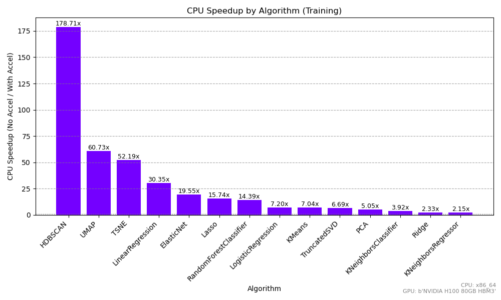
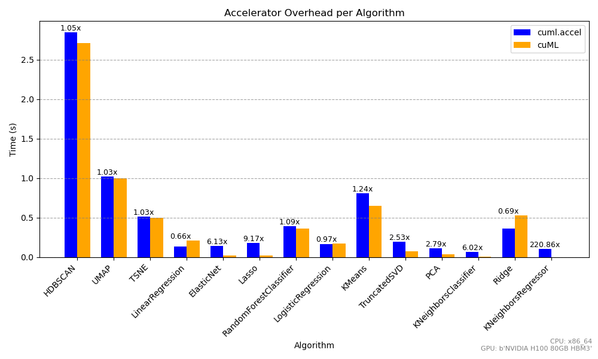
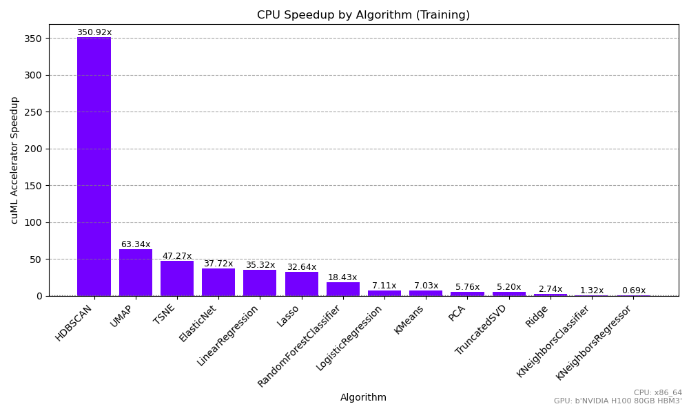
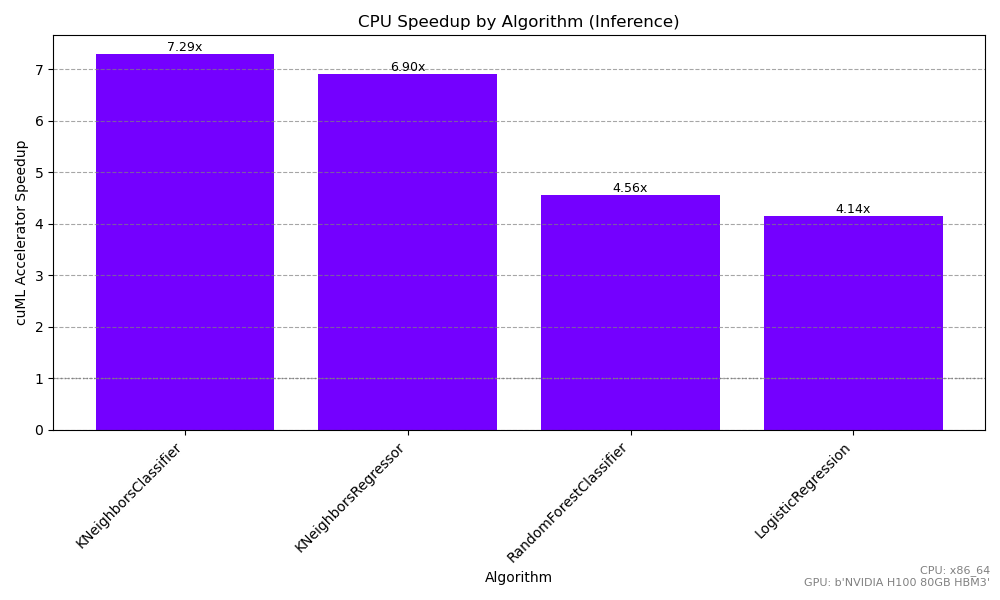

cuml.accel: Zero Code Change Acceleration Benchmarks
====================================================

Training
--------

One of the biggest advantages of cuML is how much faster training becomes. This is true as well when using the cuML Accelerator, with no code changes!

Algorithms like HDBSCAN, t-SNE, and UMAP often see speedups anywhere from 60× to over 300×, transforming tasks that could take hours or even days into minutes. Even more conventional methods such as KMeans and Random Forests can achieve training speedups of 15× to 80×, while models like LogisticRegression, Lasso, PCA, and Ridge still benefit significantly (typically in the 2×–10× range). The following benchmarks are a summary of the type of speedups that can be seen in datasets that range from 8 to 512 columns.

Comparison of cuML and cuml.accel
---------------------------------

While cuml.accel tries to provide as much acceleration as cuML-specific scripts, there is some overhead relative to direct cuML invocations. While the exact amount of overhead depends on the estimator, parameters, and data size, the overhead is typically quite low for model training:

Two important aspects arise immediately: training typically is quite computationally expensive, so the cost of transferring data from CPU to GPU and the machinery of ``cuml.accel`` have overheads that don't affect the acceleration and running time significantly. But even here, one can immediately notice that the overhead is more significant for tasks that are simpler, for example training ``KNeighbors`` models. There, using cuML directly can be significantly faster if one wants to get the maximum performance of a GPU, though it's important to note that the difference in execution time is the difference of computing in seconds vs milliseconds.

It’s also important to note how dataset shape influences these gains. For skinny datasets — where you have relatively few features but many rows — GPU acceleration still provides a great performance boost, although the relative advantage may be more modest for simpler algorithms that are already quite fast on CPU.

.. image:: img/skinny_speedup.png
   :alt: Skinny speedup

Wide datasets, on the other hand truly showcase the accelerator’s strengths. High-dimensional tasks often require intense computation and can bog down CPU-based workflows. In these cases, the cuML Accelerator steps in to deliver some of its most dramatic speedups, especially for dimension reduction methods (t-SNE, UMAP) and other math-heavy operations. It's not uncommon that a task that was unfeasible to achieve before, like incorporating UMAP and HDBSCAN in complex, high dimensional workflows, can now easily be achieved thanks to cuML and ``cuml.accel``:

Inference
----------

While the accelerator also speeds up inference, the gains tend to be smaller in absolute terms because inference is usually much faster than training to begin with. Still, seeing a 2×–7× improvement (as with KNeighbors or RandomForest) can be critical if you’re running large-scale or real-time predictions.  However, for large-batch or repeated inference scenarios, the GPU acceleration can provide significant value.

The main caveat is that data transfer overhead becomes a bigger slice of total runtime when inference itself is quick. If you’re doing tiny batches of predictions one at a time, the overhead can reduce your net benefit, and the speed between CPU and GPU can be withing statistical margin of error. The overhead can be significant in that case, in which using cuML directly with GPU inputs (like CuPy) can provide a significant advantage over using cuml.accel.

.. image:: img/inference_overhead.png
   :alt: Inference overhead

Overall, these benchmarks underscore how the cuML Accelerator can radically cut down training times for an extensive range of machine learning tasks and still offer meaningful inference improvements, all of this without the need of changing existing code, making it a compelling choice for end-to-end ML pipelines and tools.

As this is the first beta release, performance optimizations and algorithm coverage are an active area that will have improvements in the next RAPIDS releases.
