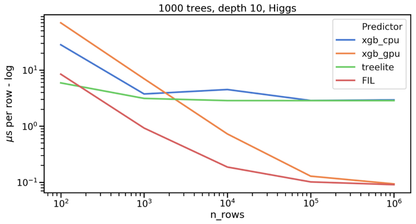

# FIL - RAPIDS Forest Inference Library

The Forest Inference Library provides a lightweight, flexible API to
infer (predict) results from a tree-based model ensemble on GPU. The
tree ensemble can be either gradient-boosted decision tree (GBDT) or
random forest (RF) models trained in XGBoost, cuML, scikit-learn, or
LightGBM.

# Code sample

Starting with an XGBoost classification model saved in the file
"xgb.mod," we want to use that model to infer on a large dataset of
test samples.

```python
from cuml import ForestInference

fm = ForestInference.load(filename=model_path,
                          output_class=True,
                          threshold=0.50,
                          model_type='xgboost')

X = ... load test samples as a numpy or cupy array ...

y_out = fm.predict(X)

```

See [the sample notebook](https://github.com/rapidsai/cuml/blob/main/notebooks/forest_inference_demo.ipynb) for much more detail and runnable samples.

Additionally, FIL can be called directly from C or C++ code. See [the API docs here](https://docs.rapids.ai/api/libcuml/nightly/namespaceML_1_1fil.html)

# Features

* Input model source: XGBoost (binary format), cuML RandomForest, scikit-learn RandomForest and similar classes, LightGBM
* Model types: Regression, Binary Classification, Multi-class Classification
* Tree storage types: Dense or sparse tree storage (see Sparse Forests with FIL blog below)
* Input formats: Dense, row-major, FP32 arrays on GPU or CPU (e.g. NumPy, cuPy, or other data formats supported by cuML). Trees are expected to be trained for float32 inputs. There may be rounding differences if trees were trained for float64 inputs.
* High performance batch inference
* Input parsing based on (Treelite)[https://github.com/dmlc/treelite]

Upcoming features:

* Support for multi-class random forests from scikit-learn
* Support for 8-byte sparse nodes to reduce memory usage for small trees is experimental
* Categorical features for LightGBM models

# Benchmarks and performance notes

(1) The core data format supported by FIL is an FP32, (row-major)[https://en.wikipedia.org/wiki/Row-_and_column-major_order] array on
GPU. All other input types will be automatically converted to this
format internally, but you will get the lowest latency if you use that
format to start with.

(2) FIL is optimized for high-throughput, batch inference, so its
performance benefits become more pronounced as the size of the test
data X grows. Larger, more complex models (e.g. those with more trees)
will also see a greater boost as they can fully occupy a large GPU.

The chart below shows how performance (measured in microseconds per
row) varies as the number of input rows increases, comparing both
CPU-based inference (XGBoost CPU inference, and the optimized treelite
library) and GPU-based inference (XGBoost and FIL).



(_Benchmarks were run on a DGX1-Volta system with 2x 20-core
Intel(R) Xeon(R) CPU E5-2698 v4 @ 2.20GHz CPUs and a single V100-32gb
GPU, using FIL 0.9.)


# Blogs and further references

* [RAPIDS Forest Inference Library: Prediction at 100 million rows per second](https://medium.com/rapids-ai/rapids-forest-inference-library-prediction-at-100-million-rows-per-second-19558890bc35)
* [Sparse Forests with FIL](https://medium.com/rapids-ai/sparse-forests-with-fil-ffbb42b0c7e3
)
* [GBM Inferencing on GPU, 2018 talk (earlier research work)](https://on-demand.gputechconf.com/gtc/2018/presentation/s8873-gbm-inferencing-on-gpu-v2.pdf)
* [Sample Notebook](https://github.com/rapidsai/cuml/blob/branch-0.16/notebooks/forest_inference_demo.ipynb)
* [GTC 2021 talk](https://www.nvidia.com/en-us/on-demand/session/gtcspring21-s31296/)
